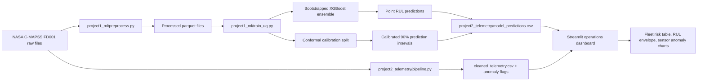

# Architecture Diagram

```mermaid
flowchart LR
    A[NASA C-MAPSS FD001 raw files] --> B[project1_ml/preprocess.py]
    B --> C[Processed parquet files]
    C --> D[project1_ml/train_uq.py]
    D --> E[Bootstrapped XGBoost ensemble]
    D --> F[Conformal calibration split]
    E --> G[Point RUL predictions]
    F --> H[Calibrated 90% prediction intervals]
    G --> I[project2_telemetry/model_predictions.csv]
    H --> I

    A --> J[project2_telemetry/pipeline.py]
    J --> K[cleaned_telemetry.csv + anomaly flags]
    I --> L[Streamlit operations dashboard]
    K --> L
    L --> M[Fleet risk table, RUL envelope, sensor anomaly charts]
```
